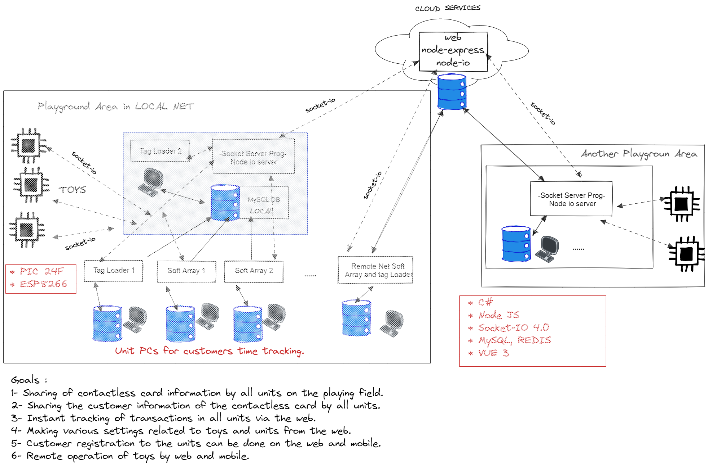

<h1 align="center">Local and WEB Based Socket-io Network</h1>
<h2 align="center">Node JS & Socket io & C# & MySql & Vue3 Composition Api </h1>

<h4 align="left">CONTENTS</h4>

- [Introduction](#Introduction)
- [System Components](#System-Components)
- [How it works](#How-it-works)
- [Used technologies](#Used-technologies)

## introduction

This study focuses on a Socket-io network structure for use in playgrounds. With this structure, it is aimed to share various information about the contactless cards used in the playground by all units in the playground over the network and to make all units and toys in the playground accessible via the web (IOT).

We can talk about two main entertainment areas in a large playground:

-The toys come in various groups that can be used individually and activated with a contactless card reader.
- Units called soft areas are entertainment areas that more than one person can benefit from at the same time. There is a PC in each unit, and thanks to the program running on it, customers are accepted into the units with contactless card, cash and credit card payment options. This program also tracks customers' length of stay in the unit and offers various options. At the end of the day, daily turnover, expenses, number of guests, etc. While reporting on issues, it also records all transactions in the web database. Thus instant turnover etc. The information can be viewed on the web. 
For more information; [Yoyuncak Playground Menagement System](https://github.com/ilyas9461/yoy-yon-system) 

In this case, we can generally express our goals as follows:
<br>

- Sharing of contactless card information by all units and toys in the playground.
- Sharing of contactless card customer information by all units.
- Transactions made in all units can be observed instantly on the network.
- Instant tracking of transactions in all units via the web.
- Remote adjustment of various settings regarding toys and units via web/local.
- Ensuring that customer registration to units can be made via web and mobile.
- Providing remote operation of toys via web/local.

This system is [Yoyuncak Playground Management System](https://github.com/ilyas9461/yoy-yon-system), which we have worked with before and is currently used in playgrounds in various places on the market (11 different playgrounds and approximately 25 PCs). ) is built on (V2).

We can list some playground entertainment centers that can be found in a large playground as follows:
- Soft Areas: These can be ball pits and sandboxes of various sizes
- Kiddy Rides toys: These are toys that appeal to children.
- Screen Toys: These are toys that can run on a PC and big screen.
- Plush toys.
- Climbing walls.
- Battery-powered cars, bumper cars.
- ...

There can be many of these on a playground. In such areas, customers usually operate a toy or enter a playground with the credits loaded onto the contactless card. In summary, the system we have developed tracks the customer's stay in the playground by offering different price-duration options to the customer in these playgrounds. At the same time, all payments can be made from the credits loaded on the contactless card or by cash or credit card. Generally, contactless cards are loaded from one or more card loading points and these contactless cards are used in other places. Therefore, contactless cards are the most important component of the system. With the new features we have integrated into this infrastructure, the system components are as follows;

<p  align="center">

</p>

## System Components :
### 1- Card system coin channel loading device (PIC24F)
### 2- Card system token channels(PIC24F) [Video ...](https://www.youtube.com/watch?v=HQXXSq4kj5s)
### 3- Playground management program V3. (C#)
### 4- Node-JS local server and socket-io. [yoy-io-server-local](https://github.com/ilyas9461/yoy-io-server-local)
### 5- Server program (c#)[YOY-Socket-ServerV1](https://github.com/ilyas9461/YOY-Socket-ServerV1)
### 6- Remote server running on the web side Node-JS and Socket-io [yoy-io-server-cloud ](https://github.com/ilyas9461/yoy-io-server-cloud)
### 7- Dashboard prepared with VUE3.
### 8- Wireless modules (ESP8266) [socket-io-study](https://github.com/ilyas9461/iot-study)

## How it works
## Part 1: Sharing Card Information by Local and Remote Units:
The average weekly number of visitors in a large playground can vary between 3000-7000. During busy times, more than one PC can be placed in one area. For example, when you create two or more card loading points, if the deposit status of the cards is not shared between the PCs, the cards will get mixed up between the PCs. Re-entering customer information into the tracking program in every area during a very busy time causes queues to form. It is important for the operator to determine in which area or when the various malfunctions on the cards (contours being erased, the toy pulling the contours and not working, etc.) occurred in the toy or in which area it occurred, in compensatory loadings. In addition, if the operator has an agreement with a shopping mall, the shopping mall can give locations to the operator at different points. In this case, sharing card information becomes important for customer satisfaction and its increase. With this system, a blacklist can be created for cards and the use of the card can be removed from the system. In this way, the use of lost or stolen cards can be prevented.

While determining the system architecture, situations such as internet connection loss were taken into consideration. It saves the PC data in each unit both to itself and to the database on the local PC designated as the server PC. Locally, the system can operate on its own even if there is no internet connection, as long as the modem is active. While programs running in the units may experience some delay problems when sending data to the web, the system operating speed has increased by ensuring that the programs only send data to themselves and to the database on the local server PC. The local server program running on the Server PC works like a bridge between the local network and the web. Depending on the operation performed, the program in each unit sends event-based notifications to the node-js socket-io server running on the server PC through the specified port. The server program running on the Server PC is subscribed to these notifications. It takes the necessary actions according to the incoming event and data. Event data travels through the socket-io structure. The server program sends data to the web database. In this way, some security problems that may occur are prevented. The units included in the system via another internet connection send the event data to the node-js socket-io server running on the web. These programs can also send data directly to the web database. The server program running locally is also a member of the socket-io server notifications on the web. This is how the bridge functions. It also broadcasts local events to the web, and web events to the local. In this way, two-way sharing of data is ensured.

###  Desktop Sample Test Video :

In this video, an attempt is made to show the verbal explanation of the system and the test work carried out during development in the workshop environment.

<a href="https://youtu.be/RWEq8n_fpZ4" target="_blank">
     
</a>

###  Field Application Video :

In this video, the system was installed in a playground in a shopping mall in Ankara, serving its customers with 7 different units. One of these units (Sand Pool) is included in the system via a different internet connection. An attempt has been made to show instant data sharing. It has been observed that the system data flow is realized and the desired purposes are achieved. In the video, observations were made by connecting remotely to the PCs in the units. The average number of visitors per month in the playground in the shopping mall where the system is installed reaches 10,000. Especially on weekends, the visitor density can be as much as during the week in one day.
It has been observed that the system can work integrated with the web even at this density.


<a href="https://youtu.be/hlyKu-M-aUk" target="_blank">
      
</a>
<br><br>

## Part 2: Incorporating Toys into the Network:
... ...

## Used technologies

```bash
- C#, SocketIOClient
- Node js, Expres, socket-io 4.x
- MySql
- PICC compiler, PIC24F Microcontroller
- ESP8266 Microcontroller
- MIFARE Contactless Cards

```


- GitHub [@your-ilyas9461](https://github.com/ilyas9461)
- Linkedin [@your-linkedin](https://www.linkedin.com/in/ilyas-yagcioglu/)
